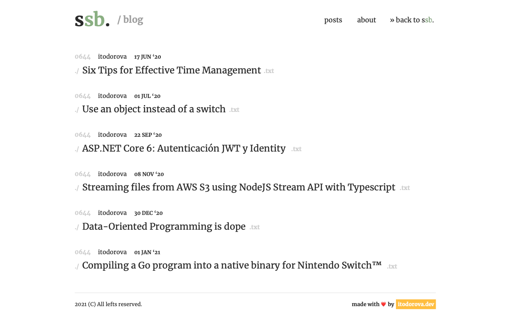

# jekyll-theme-superb

This is a simple Jekyll theme that uses [tailwindCSS's-based ui-kit](https://github.com/simplysuperb-dev/ui-kit) of simply**superb**. My blog uses it currently, so you can see it live at: https://blog.simplysuperb.app/. Additionally, here's a screenshot*:



  _\* Article titles were copied from [dev.to](dev.to)'s homepage at the time of designing of this template._
## Installation

Add this line to your Jekyll site's `Gemfile`:

```ruby
gem "jekyll-theme-superb"
```

And add this line to your Jekyll site's `_config.yml`:

```yaml
theme: jekyll-theme-superb
```

And then execute:

    $ bundle

Or install it yourself as:

    $ gem install jekyll-theme-superb

## Usage

Theme has a `post` layout used for displaying a single post, an `index` layout used for displaying all posts and a page layout that differs slightly from the `post` layout.

## Configuration

@TODO: Document all available config options

## Contributing

Bug reports and pull requests are welcome on GitHub at https://github.com/simplysuperb-dev/jekyll-theme-superb. This project is intended to be a safe, welcoming space for collaboration, and contributors are expected to adhere to the [Contributor Covenant](http://contributor-covenant.org) code of conduct.

## Development

To set up your environment to develop this theme, run `bundle install`.

Your theme is setup just like a normal Jekyll site! To test your theme, run `npm run jekyll:dev` and open your browser at `http://localhost:4000`. This starts a Jekyll server using your theme. Add pages, documents, data, etc. like normal to test your theme's contents. As you make modifications to your theme and to your content, your site will regenerate and you should see the changes in the browser after a refresh, just like normal.

Additionally, the theme is based on tailwindCSS, so postcss is required to modify existing styles:

    $ npm install
    $ npm run css:dev


When your theme is released, only the files in `_layouts`, `_includes`, `_sass` and `assets` tracked with Git will be bundled.
To add a custom directory to your theme-gem, please edit the regexp in `jekyll-theme-superb.gemspec` accordingly.

## License

The theme is available as open source under the terms of the [MIT License](https://opensource.org/licenses/MIT).

